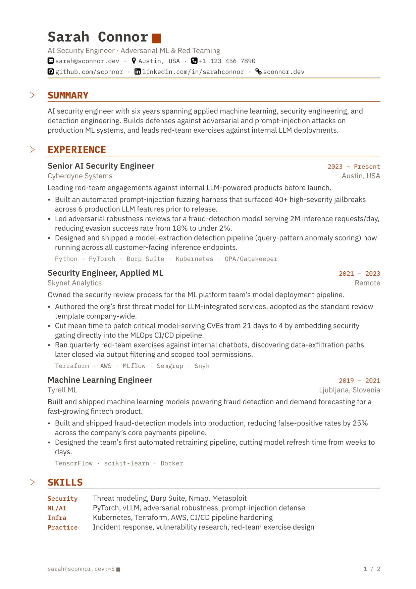
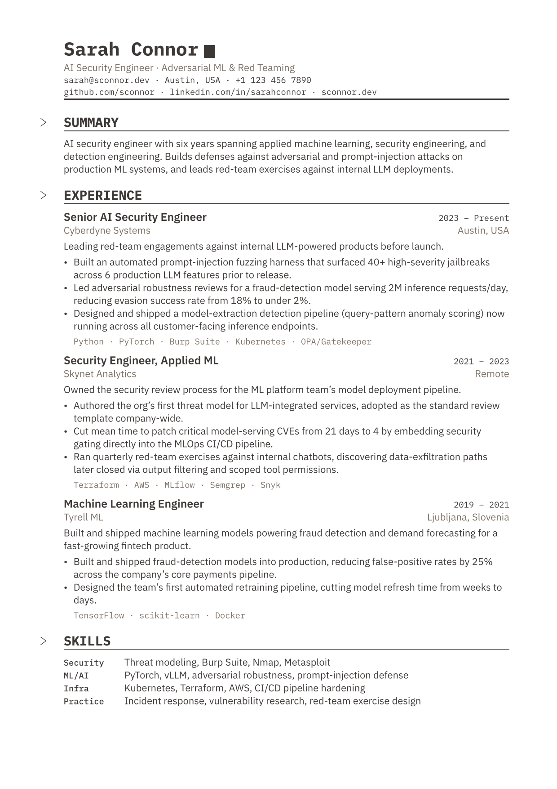
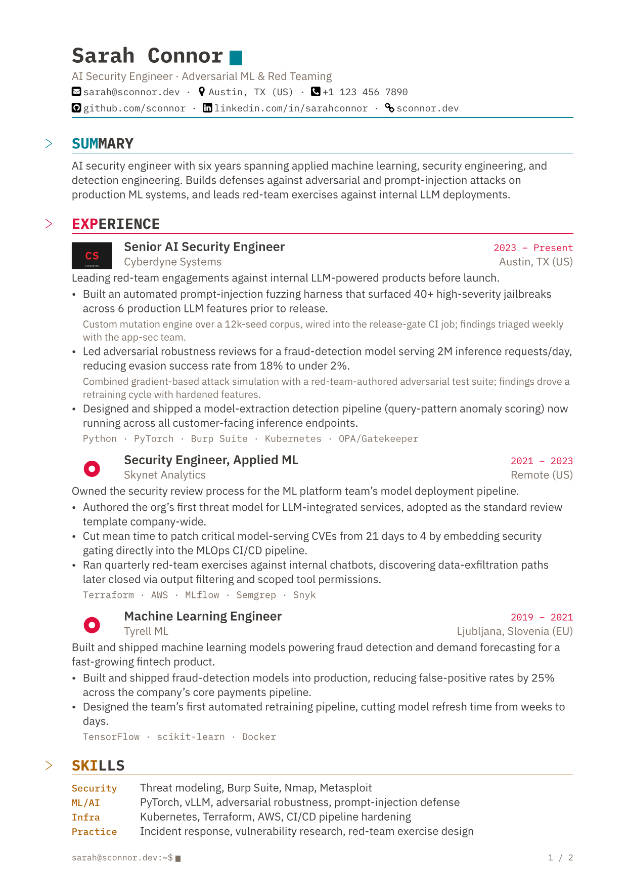

# cyber-cv-letter

A terminal/hacker-themed CV and cover-letter template for [Typst](https://typst.app),
also usable from Markdown via Pandoc. Built for two readers: a naive ATS
text-extractor (linear reading order, real text, nothing decorative in the
text stream) and a human skimming for six seconds (bold titles, scannable
hierarchy, restrained color). Targets PDF/UA-1 by construction, and every
text color clears WCAG AA contrast.

## Preview

| CV | CV (plain) | CV (friggeri) | Letter |
|:---:|:---:|:---:|:---:|
|  |  |  |  |

## Usage

### Typst

```sh
typst init @preview/cyber-cv-letter:0.1.0 mycv
```

Or import directly:

```typst
#import "@preview/cyber-cv-letter:0.1.0": cv

#show: cv.with(
  author: (
    name: "Sarah Connor",
    tagline: "AI Security Engineer · Adversarial ML & Red Teaming",
    email: "sarah@example.com",
    location: "Fremont, CA",
    links: ("github.com/sconnor",),
  ),
  keywords: ("Adversarial ML", "Red Teaming", "LLM Security"),
)

= EXPERIENCE

== Senior AI Security Engineer | 2023 -- Present

_Cyberdyne Systems | Austin, TX (US)_

Leading red-team engagements against internal LLM-powered products.

- Built a prompt-injection fuzzing harness that surfaced 40+ jailbreaks pre-release.
  #quote(block: true)[Custom mutation engine, wired into the release-gate CI job.]

`Python · PyTorch · Kubernetes`

/ Security: Threat modeling, Burp Suite, Nmap
```

```sh
typst compile mycv.typ
```

`examples/typst/cv.typ` and `examples/typst/letter.typ` are complete
reference documents exercising every `cv()`/`letter()` parameter.

### Markdown, via Pandoc

```markdown
---
name: Sarah Connor
tagline: AI Security Engineer · Adversarial ML & Red Teaming
email: sarah@example.com
location: Fremont, CA
links:
  - github.com/sconnor
keywords:
  - Adversarial ML
  - Red Teaming
  - LLM Security
---

# EXPERIENCE

## Senior AI Security Engineer | 2023 -- Present

*Cyberdyne Systems | Austin, TX (US)*

Leading red-team engagements against internal LLM-powered products.

- Built a prompt-injection fuzzing harness that surfaced 40+ jailbreaks pre-release.
> Custom mutation engine, wired into the release-gate CI job.

`Python · PyTorch · Kubernetes`

Security
: Threat modeling, Burp Suite, Nmap
```

```sh
pandoc mycv.md -d path/to/cyber-cv-letter/pandoc/cv.yaml -o mycv.pdf
```

One command, no intermediate `.typ` file — see `pandoc/cv.yaml`'s own
comments for adjusting `pdf-engine`/`--package-path` to your environment.
Section names are freeform: how a section renders is decided by the shape
of its content (entries vs. definition list vs. prose), never by its
heading text. `examples/markdown/cv.md` and `examples/markdown/letter.md`
are complete reference documents.

Either workflow needs the real `typst` CLI binary for Pandoc's
`--pdf-engine=typst` (the Python `typst` package is bindings-only, no CLI).

## Development

This repo builds and tests its own examples locally; nothing is installed
system-wide:

```sh
make setup      # vendors pandoc + typst into .venv/
make examples   # builds the 8-PDF example matrix (cv/cv-plain/cv-friggeri/letter × typst/markdown)
make test       # contrast, spacing, ATS-extraction, and rendered-layout checks (tests/)
make thumbnails # renders the preview PNGs above
```

## Known limitations

- No cross-page "keep together" grouping: a section header or skills row
  can split across a page boundary from its first entry/row.
- A published package can't bundle its own fonts (IBM Plex Mono/Sans) onto
  a consumer's font search path — without them installed, Typst falls back
  to automatic substitution. This repo's own build passes `--font-path
  fonts` explicitly.

## License

AGPL-3.0-or-later — see `LICENSE.txt`. Bundled fonts (`fonts/`) and icons
(`icons/`) carry their own licenses in the same directories.
