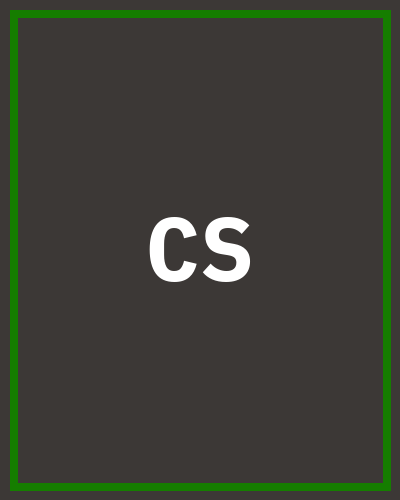

# Summary

AI security engineer specializing in adversarial ML detection and red-teaming for
production LLM systems. Shipped detection infrastructure handling 50k+ req/s with
sub-second alert latency.

# Experience

## Senior AI Security Engineer | Jun 2023 – Present

*[] Cyberdyne Systems | Los Angeles, CA*

Cut adversarial-example detection latency 4x by rewriting the [batch, heads, seq, seq]
scoring path to run inline with inference rather than as a post-hoc batch job.

- Built a red-team harness that found 12 prompt-injection classes missed by the prior
  eval suite, raising the pre-release catch rate from 61% to 94%.
- Led migration of the model-serving detection pipeline to a streaming architecture,
  cutting p99 alert latency from 4.2s to 380ms.
- Mentored two junior engineers on adversarial evaluation methodology; both now own
  detection surfaces independently.

`PyTorch · vLLM · Triton · Kubernetes`

## AI Security Engineer | Jan 2021 – May 2023

*Widget Robotics | Remote*

Owned anomaly scoring for a fleet-telemetry pipeline processing 50k events/s.

- Shipped an anomaly scoring service that cut false-positive alert volume 70% by
  replacing static thresholds with a learned per-device baseline.
- Built the eval harness now used across three teams to benchmark detection recall
  against a held-out attack corpus before every model release.

`Python · scikit-learn · Kafka · Terraform`

## Machine Learning Engineer | Aug 2019 – Dec 2020

*Nova Systems Analytics | San Diego, CA*

- Trained and deployed a fraud-scoring model that reduced chargeback losses 18%
  in its first quarter in production.
- Instrumented model-serving latency tracing, cutting p99 debugging time from days
  to hours for the on-call rotation.

# Skills

Detection
: Adversarial example detection, Anomaly scoring, Red-teaming, Eval design

Adversarial ML
: Prompt injection, Model extraction, Data poisoning

Infra
: Kubernetes, Terraform, Triton, CUDA, Kafka

# Education

MS Computer Science, University of California, San Diego — 2019

# Certifications

OSCP — Offensive Security Certified Professional, 2022
