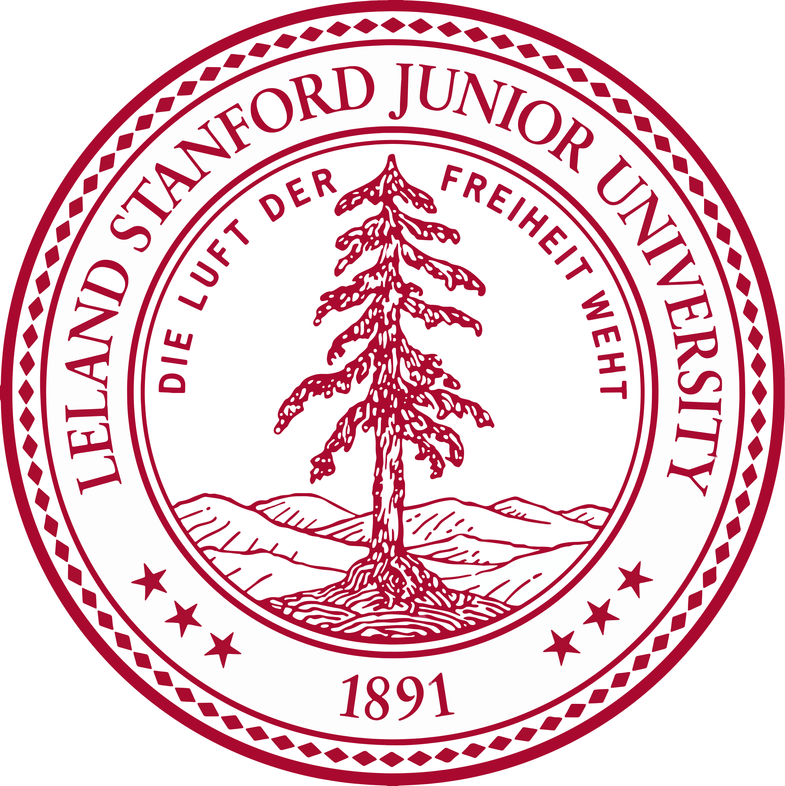

# SUMMARY

AI security engineer with six years spanning applied machine learning, security engineering, and detection engineering. Builds defenses against adversarial and prompt-injection attacks on production ML systems, and leads red-team exercises against internal LLM deployments.

# EXPERIENCE

## Senior AI Security Engineer | 2023 -- Present

* Cyberdyne Systems | Fremont, CA*

Leads detection engineering for production ML systems serving over ten million inference requests a day.

- Built an adversarial-example detector that cut false negatives by 40% against a red-team benchmark suite.
> Runs as a sidecar service in front of the inference API, scoring every request before it reaches the model.
- Led quarterly red-team exercises against internal LLM deployments, uncovering prompt-injection paths later closed with input sanitization.
- Introduced model-serving anomaly scoring, reducing mean incident detection time from six hours to twenty minutes.

`PyTorch · vLLM · LangChain · Ray`

## Security Engineer | 2021 -- 2023

*Skynet Analytics | Remote*

Owned security for the model-serving platform supporting the company's recommendation and fraud-detection products.

- Built anomaly-detection pipelines for model-serving infrastructure, catching two supply-chain compromises in third-party model artifacts.
- Automated red-team tooling for LLM jailbreak testing, cutting manual review time by 70%.
- Partnered with platform engineering to add authenticated model-artifact signing across the deployment pipeline.

`Terraform · AWS · Python`

## Machine Learning Engineer | 2019 -- 2021

*Tyrell Applied ML | Ljubljana, Slovenia*

Built and shipped machine learning models powering fraud detection and demand forecasting for a fast-growing fintech product.

- Built and shipped fraud-detection models into production, reducing false-positive rates by 25% across the company's core payments pipeline.
- Designed the team's first automated retraining pipeline, cutting model refresh time from weeks to days.
- Mentored two junior engineers on feature engineering and model evaluation practices.

`TensorFlow · scikit-learn · Airflow · Docker`

# SKILLS

Security
: Burp Suite, Nmap, Metasploit, OSCP methodology, threat modeling

ML/AI
: PyTorch, vLLM, adversarial robustness, prompt-injection defense

Infra
: Kubernetes, Terraform, AWS, CI/CD pipeline hardening

Practice
: Incident response, secure SDLC, red-team exercise design

# EDUCATION

## M.S. Computer Security | 2021

* Stanford University | Stanford, CA*

## B.S. Computer Science | 2019

*University of Ljubljana | Ljubljana, Slovenia (EU)*

# PROJECTS

## promptfirewall | 2023

*github.com/sconnor/promptfirewall*

# CERTIFICATIONS, AWARDS & PUBLICATIONS

## AI Village CTF -- 1st Place | 2024

*DEF CON*

## Detecting Prompt Injection at Scale | 2024

*arXiv preprint | arxiv.org/abs/2403.09217*

## OSCP -- Offensive Security Certified Professional | 2019

*Offensive Security*
